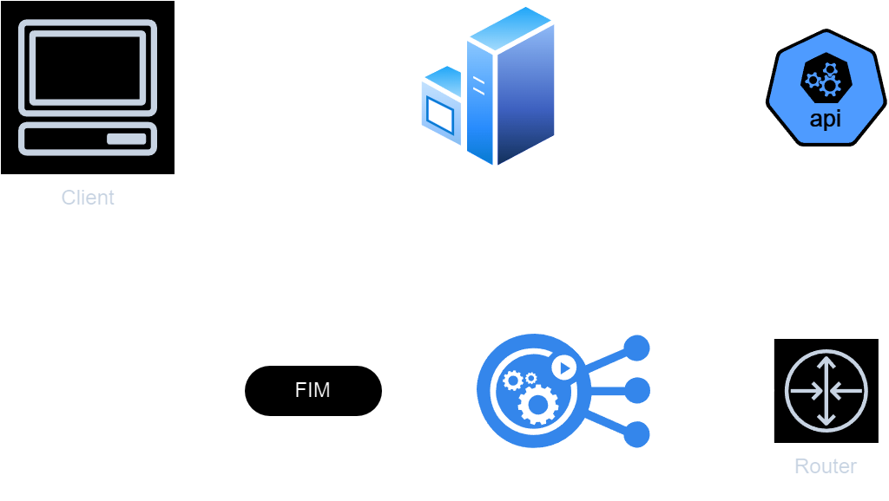

# Como rodar o projeto ?

API que retorna um número por extenso

### como iniciar o servidor em modo de desenvolvimento ?
```bash
  npm run dev
```

### como iniciar o servidor em produção ?
```bash
  npm start
```

### como rodar os testes ?
```bash
  npm run test
```


## Exemplo de uso

### Numero por extenso

```http
  POST /numero/extenso
```
*Request body*

{

    "numero": "99"
}

*Response body*

{

    "message": "noventa e nove"
}
    
    
# Fluxograma
